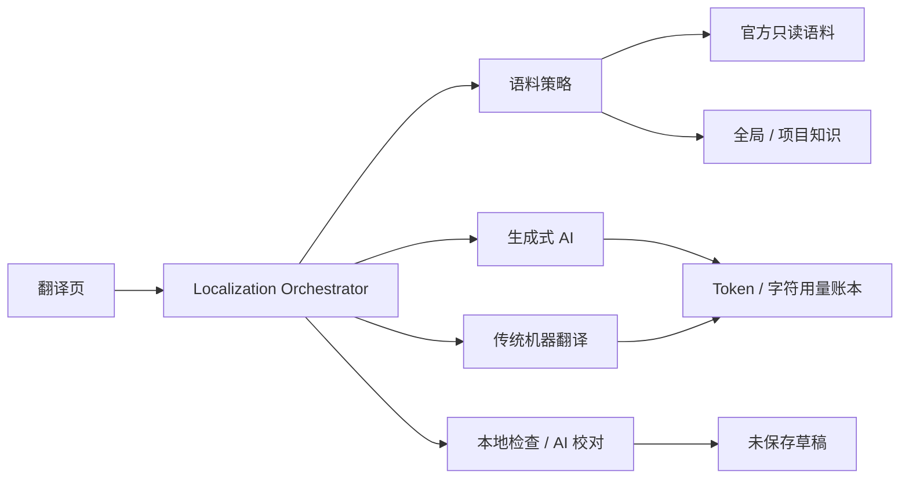
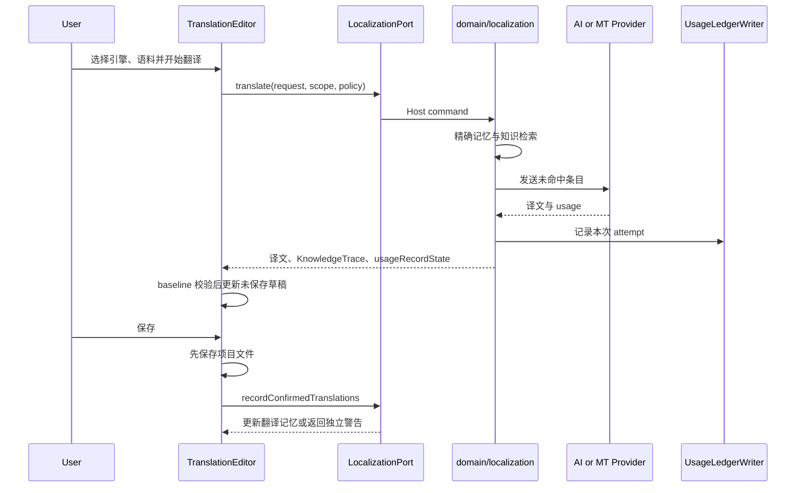

# AI 本地化中心、用量记录、机器翻译与校对计划

> 状态：方案已确认，待实施  
> 范围：`apps/desktop` 前端、Rust 后端、Host Runtime 及本地持久化  
> 最后更新：2026-07-14

## 1. 目标

建设统一的 `domain/localization`，负责官方语料、用户知识、翻译记忆、传统机器翻译和校对编排。现有 `domain/ai` 继续负责生成式 AI 协议，不承载传统机器翻译的认证和 wire protocol。

工作台新增“AI 本地化”页面，翻译页增加校对 inspector 和“使用语料”控制。应用设置的 AI 分类增加传统机器翻译档案和全局用量记录。



## 2. 翻译引擎

### 2.1 生成式 AI

保留现有三个 `AiProtocol`：

- `openai-responses`
- `openai-chat-completions`
- `anthropic-messages`

不增加 Gemini GenerateContent。Gemini 继续通过 Google 的 OpenAI Chat Completions 兼容端点使用。

### 2.2 传统机器翻译

新增独立的 `MachineTranslationProtocol`，传统翻译接口不能伪装成 Chat Completions。首批内置：

- DeepL API，提供 Free 和 Pro 两个官方端点预设。
- Google Cloud Translation Basic v2，首批只支持 API Key，不引入 OAuth、Vertex 或服务账号。
- Microsoft Translator v3。
- 百度通用翻译 API。
- 腾讯云 TMT。
- LibreTranslate，支持官方服务、HTTPS 自托管端点和 loopback 本地端点。

百度档案保存 App ID 与 Secret，腾讯档案保存 Secret ID、Secret Key 和 Region。每个凭据字段分别写入系统钥匙串，前端只能读取是否已配置及实际凭据来源。

每个 adapter 声明语言列表来源、单项与批次字符上限、HTML 能力、术语能力、用量能力和认证方式。DeepL、Google、Microsoft、LibreTranslate 动态读取语言能力；百度和腾讯使用带版本的官方语言映射。

所有传统翻译请求沿用 10 秒连接超时、60 秒响应超时、429/5xx 最多重试两次的规则。跨域重定向不得携带认证信息。占位符、BBCode 和 Stardew 控制标记在请求前结构化保护，响应后按精确集合验证；验证失败的结果不得写入草稿。

### 2.3 统一路由

新增 `LocalizationEngineRef`，类型为 `generative-ai` 或 `machine-translation`，分别引用对应档案。每个知识作用域保存默认翻译引擎和默认校对 AI 档案，任务菜单允许临时覆盖。

一次翻译按以下顺序执行：

1. 查找精确确认记忆并本地补全。
2. 把未命中的条目发送给选定引擎。
3. 执行本地格式、占位符和术语检查。
4. 根据用户配置生成校对建议。

生成式 AI 可以使用术语、风格、模糊记忆和官方例句。传统机器翻译启用语料时，只使用精确记忆做本地补全，并在译后执行官方与用户术语检查。

传统引擎不支持任意提示上下文时，界面必须明确显示“该引擎仅使用精确记忆和术语检查”，不能假装已经向供应商发送风格或模糊例句。本阶段不自动创建或同步 DeepL、Google 等供应商的远程 glossary，避免遗留远程资源。

“机器翻译后 AI 校对”是显式选项，默认关闭。启用后会产生第二次独立请求，并单独记录 Token 用量。

## 3. 语料策略

新增结构化 `KnowledgePolicy`：

```ts
type KnowledgePolicy = {
  enabled: boolean
  useOfficialCorpus: boolean
  useGlobalKnowledge: boolean
  useProjectKnowledge: boolean
}
```

语料控制采用“项目默认 + 任务覆盖”。项目保存默认策略，每次翻译菜单可以临时切换官方、全局和项目语料。总开关关闭后，不查询、不编译、不发送任何官方或用户语料；占位符等强制安全规则不受影响。

翻译结果返回 `KnowledgeTrace`，只包含命中来源和数量，不包含语料正文。后端根据 active official generation、全局 revision、项目 revision 和本次策略生成 `knowledgeRevision`。任何依赖语料的缓存键都必须包含该 revision，修改术语、切换语料或重建官方索引后不能复用旧译文。

Launcher 没有绑定知识作用域，默认不使用 Stardew 官方语料。工作台翻译必须明确绑定全局或项目作用域。云端档案只接收实际命中的少量语料；本地档案沿用相同策略，但数据不离开本机。

## 4. 官方游戏语料

### 4.1 数据来源

索引当前工作台已验证游戏目录下的 `Content/**/*.xnb`。正常游戏安装不要求存在预解包目录；索引必须复用项目现有 XNB 解析模块读取内容，禁止另建解析器或把 `Content (unpacked)` 作为前置条件。

无语言后缀的 XNB 作为 `en-US` 基线，`.<locale>.xnb` 作为官方语言版本，按相对资产路径和内容 key 对齐。索引不得读取任意用户目录，也不得跟随逃逸 `Content` 根目录的符号链接。

### 4.2 索引结构

官方语料保存到独立、只读、可重建的 `official-localization.sqlite3`。数据表包括：

- `official_assets`：相对资产路径、分类和 fingerprint。
- `official_units`：资产、JSON key、unit kind 和上下文。
- `official_texts`：unit、locale、文本及文本 hash。
- FTS5 trigram 搜索索引。

源文本只保存一次，各语言通过 unit 关联，因此可以使用 `fr-FR -> zh-CN` 等非英语语言对。

`Fonts/**` 永久排除。没有基线的文件、非字符串值、孤立 key 和解析错误进入索引报告，不得伪造配对。

### 4.3 内容分类

extractor registry 把内容分为：

- `term`
- `plain-text`
- `dialogue`
- `event-script`
- `structured-record`
- `opaque`

Strings 名称表生成官方术语；普通 Strings、角色对白和经过安全提取的文本生成官方例句。事件脚本及复合 Data 值必须使用格式专用 extractor，禁止通过通用 `/` 切割或正则猜测字段。

没有安全 extractor 的内容仍可在本地化中心搜索，但标记为 `opaque`，不能作为模糊例句发送给模型。

### 4.4 检索与更新

FTS5 trigram 先召回前 50 条，再使用标准字符串相似度重排。模糊匹配阈值为 `0.78`，每个翻译条目最多使用 5 条官方例句。

索引状态由游戏 DLL 版本、XNB 相对路径、大小和修改时间生成 fingerprint。打开本地化中心时只检测状态，不自动执行全量解析；建立或更新索引必须由用户点击触发。

索引使用 generation staging。新 generation 完整校验后原子切换为 active，再删除旧 generation。取消、崩溃、文件删除或游戏更新都不能留下半成品或继续使用旧官方文本。

新增 `AiOfficialIndexing` execution pool，归属 `Mutation` lane，使用 1 个 worker 和 8 个排队槽，避免长时间索引占用普通 IO、普通 Mutation 或远程 AI pool。

同时修复现有 unpacked fallback：本地化 XNB 应优先读取 `Content (unpacked)/path/file.<locale>.json`，再回退无后缀基线 JSON。

官方语料不能进入知识包、CSV、TMX 或用量日志。用户可以显式把选中官方条目复制为可编辑的全局或项目术语。

## 5. 用户知识

用户知识保存到独立、带版本的 `ai-localization.sqlite3`，内容包括作用域、项目绑定、术语、风格指南、确认记忆、QA 配置和审校历史。

知识优先级固定为：

```text
项目术语 > 全局术语 > 官方术语
项目确认记忆 > 全局确认记忆 > 官方例句
项目风格 > 全局风格
```

CP Maker 项目优先使用 Project UniqueID，现有模组优先使用 manifest UniqueID；缺失时分别回退到 draft key 和规范路径 hash。数据库内部使用 UUID，并提供项目重新绑定能力。

翻译记忆只收录用户成功保存的译文，不迁移 AI 缓存，也不记录未保存草稿。自动学习以 `scope + locale pair + file + key` 覆盖；全量保存会清除该文件已删除的自动学习项，手工及导入记忆不受影响。

支持以下交换格式：

- ModForge Knowledge Pack JSON。
- 术语 CSV。
- 翻译记忆 TMX。

单次导入限制 20 MB，每作用域最多 10,000 条术语、100,000 条记忆，风格内容最多 16 KB。审校历史每作用域保留最近 50 个批次，只保存问题条目的文本快照。

## 6. 用量账本

### 6.1 记录内容

新增应用级 `ai-usage.sqlite3`，覆盖 Launcher 翻译、工作台翻译、校对、连接测试和每一次重试。

每条明细保存：

- 时间、job ID 和 attempt。
- 页面来源与操作类型。
- 引擎类型、档案、供应商和模型。
- 项目作用域、成功状态、延迟和失败分类。
- 请求项数、请求字符数和响应字符数。
- 供应商返回的 Token 或计费字符字段。

OpenAI Responses 记录 input、output、cached input 和 reasoning tokens。Chat Completions 记录 prompt、completion、cached prompt 和 reasoning tokens。Anthropic 记录 input、output、cache creation 和 cache read tokens。

兼容供应商没有返回 usage 时不得伪造 Token。系统仍记录请求和响应字符数，并标记 `provider-reported` 或 `unavailable`。

DeepL 优先记录 `billed_characters`，Microsoft 读取 metered usage；其余传统机器翻译保存供应商返回值或本地请求字符数，并明确是否为计费值。每个 retry attempt 单独记录，不能隐藏可能重复产生的用量。

用量记录禁止保存 prompt、源文、译文、术语、响应正文、密钥和认证头。

### 6.2 持久化与保留

使用专用 `UsageLedgerWriter` 串行写入并等待确认，网络命令不得持有数据库资源锁。账本故障不能把成功翻译变成失败，也不能触发供应商重试；结果返回 `usageRecordState` 并发布独立通知。

保留策略为 90 天逐请求明细，过期记录按日、档案、操作和引擎聚合后删除。日汇总长期保存，直到用户主动清理。

应用设置 AI 分类提供今天、7 天、30 天及自定义范围统计，支持按档案、模型和操作筛选，Token 与字符分列显示，并支持 CSV 导出和清理。本地化中心只显示当前项目的翻译与校对用量。

本阶段不估算费用，不硬编码供应商价格。

## 7. 工作台页面

注册 `ai-localization` standalone 工具模块，使用 Lucide `BookOpenCheck` 图标。无活动项目时也可以管理全局内容。

页面采用左侧作用域列表、中间标签页、右侧 inspector。标签包括：

- 官方语料
- 术语
- 风格
- 翻译记忆
- QA 与历史
- 项目用量

官方语料页展示游戏版本、fingerprint、语言覆盖、对齐数量、错误、索引状态和重建进度。术语、记忆、历史和用量使用服务器分页的密集表格，编辑和冲突处理放在 inspector，不使用卡片墙。

顶部提供索引、导入、导出、清理和档案选择。“配置模型”只跳转应用设置的 AI 分类，不在工作台重复实现密钥和模型管理。

工作台项目上下文应依据 `projectAccess` 注入，并提供 optional project hook，让 standalone 页面能够选择性读取当前项目。窄窗口使用“作用域 / 内容 / 详情”分段视图，避免三栏压缩和横向溢出。

所有新增文案进入 `en-US`、`zh-CN` typed locale bundles，颜色和状态使用现有主题 token。

## 8. 翻译页校对

翻译页增加语料策略菜单、引擎选择、“校对当前项 / 校对已翻译 / 校对全部”和可折叠校对 inspector。

宽屏布局为 `280px 条目目录 + 编辑区 + 340px 校对区`。窄屏使用“条目 / 译文 / 校对”分段切换。

校对先执行本地确定性检查：空译文、占位符、BBCode/标记、语言混杂、非法空白和长度约束。非空译文再交给选定 AI 档案检查：

- 遗漏或增译
- 含义错误
- 术语不一致
- 流畅度和语法
- 语气与风格
- 区域格式
- 占位符与标记

严重度固定为 `minor`、`major`、`critical`。官方术语不一致默认生成建议，但项目或全局术语可以合法覆盖官方译法。

AI 只返回问题、原因和可选修订，不直接覆盖译文。用户可以逐条接受、忽略或勾选批量接受。接受前必须校验 source/target baseline hash，并再次验证占位符和标记；过期建议不可应用。

接受后的结果只写入未保存草稿，绝不自动保存。项目可以显式开启“翻译后自动校对”，但仍然只生成建议。

保存成功后异步更新翻译记忆。记忆写入失败应发送通知，但不能把已经成功的项目保存标记为失败。

## 9. 公共接口与分层

新增 `LocalizationPort`，作为工作台翻译的统一入口；`AiPort` 继续供生成式 AI 和 Launcher 使用。

新增公共类型：

- `MachineTranslationProfile`、`MachineTranslationPreset`、`MachineTranslationCapability`
- `LocalizationEngineRef`
- `KnowledgePolicy`、`KnowledgeTrace`
- `AiOfficialCorpusStatus`、`AiOfficialUnit`
- `AiLocalizationScope`、`AiGlossaryEntry`、`AiStyleGuide`、`AiTranslationMemoryEntry`
- `AiReviewRequest`、`AiReviewResult`、`AiReviewIssue`
- `AiUsageRecord`、`AiUsageQuery`、`AiUsageSummary`、`AiUsageExportRequest`

新增官方索引、用户知识、传统翻译档案、统一翻译、校对和用量 Host commands，并通过生成器维护 `HOST_COMMANDS`。

`entities/localization` 提供工作台共用 provider、状态和编排。它不能与 `entities/ai` 横向互相导入，两者由 app provider 注入端口组合。

Rust `domain/localization` 可以调用 `domain/ai` 的内部结构化生成能力，`domain/ai` 不得反向依赖 localization，避免循环依赖。

## 10. 具体落地

### 10.1 前端目录与职责

前端按现有 FSD 边界落位，不建立 `processes`、`components` 或顶层 `utils`：

```text
apps/desktop/src/
  shared/contracts/
    localization.ts                 # LocalizationPort、MT、语料、校对和用量 DTO
  entities/localization/
    model/LocalizationProvider.tsx  # 注入 LocalizationPort
    model/localizationFailure.ts    # 错误码解析与安全展示
    model/knowledgePolicy.ts        # 策略合并、临时覆盖和 trace 纯逻辑
    model/localizationJobs.ts       # 翻译、校对、索引任务的 headless 状态
    index.ts                        # 唯一公开入口
  platform/host/
    localization.ts                # HostCommandClient 策略和事件订阅
  app/providers/
    LocalizationPlatformProvider.tsx
  app/app-shell/settings/ai/
    AiSettingsPanel.tsx             # 只负责设置页签组合
    GenerativeAiProfilesSection.tsx
    MachineTranslationProfilesSection.tsx
    AiUsageSection.tsx
  pages/workbench/tools/ai-localization/
    model/useAiLocalizationPage.ts
    model/localizationPageState.ts
    ui/AiLocalizationView.tsx
    ui/LocalizationScopeRail.tsx
    ui/OfficialCorpusView.tsx
    ui/GlossaryView.tsx
    ui/StyleGuideView.tsx
    ui/TranslationMemoryView.tsx
    ui/QualityHistoryView.tsx
    ui/ProjectUsageView.tsx
    index.ts
  pages/workbench/ui/module-runtimes/
    AiLocalizationModuleRuntime.tsx
  features/translation-editor/
    model/useLocalizationTranslation.ts
    model/useTranslationReview.ts
    model/translationReview.ts
    view/TranslationEngineMenu.tsx
    view/TranslationKnowledgeMenu.tsx
    view/TranslationReviewInspector.tsx
    view/TranslationEditor.tsx
```

`entities/localization` 是无 UI 的稳定领域边界，因为本地化中心、项目翻译和现有模组翻译都会使用它。页面专属列表、筛选和 inspector 状态留在 `pages/workbench/tools/ai-localization`。校对交互留在已经被两个工作台 runtime 复用的 `features/translation-editor`。

`entities/localization` 和 `entities/ai` 不允许横向引用，也不使用 `@x`。`LocalizationPlatformProvider` 和 `AiPlatformProvider` 在 `app/App.tsx` 组合，各自注入独立端口。

样式继续使用现有 Tailwind utility 和全局 `@layer components`，不增加 CSS Modules 或 CSS-in-JS：

- `styles/workspace/ai-localization.css` 负责本地化中心布局。
- `styles/features/ai-settings.css` 负责 AI 设置页。
- `styles/features/translation-editor-ai.css` 变为聚合入口，并按 toolbar、review inspector、responsive 拆分子文件。
- 工作台样式通过现有 `styles/workbench.css` 懒加载，全局入口仍只有 `styles/index.css`。

### 10.2 TranslationEditor 接口调整

`TranslationEditor` 的业务 props 调整为：

```ts
type TranslationLocalizationContext = {
  projectIdentity: {
    kind: 'cp-maker' | 'installed-mod'
    stableId: string | null
    fallbackPath: string | null
  }
  displayName: string
  sourceNamespace: string
}

type TranslationEditorProps = {
  localizationContext: TranslationLocalizationContext | null
  onSave: () => Promise<void>
  onOpenLocalizationCenter: (scopeId: string | null) => void
  // 保留现有项目、locale、筛选、文件和 reload props
}
```

`ProjectTranslationModuleRuntime` 使用 Project UniqueID 和 draft key 构造 identity；`ModTranslationModuleRuntime` 使用 manifest UniqueID 和规范化项目路径。两个 runtime 都把保存函数改成可等待的 Promise，只有项目文件保存成功后才调用 `recordConfirmedTranslations`。

原 `useTranslationAi` 替换为 `useLocalizationTranslation`，工作台不再直接调用 `AiPort.translateBatch`。Launcher 保留现有 AI 翻译 hook，不受这次迁移影响。

### 10.3 Rust 模块

```text
apps/desktop/src-tauri/src/
  domain/localization/
    mod.rs
    types.rs
    orchestrator.rs
    scope.rs
    knowledge/
      store.rs
      resolver.rs
      import_export.rs
    official/
      index.rs
      search.rs
      extractors.rs
    machine_translation/
      mod.rs
      deepl.rs
      google.rs
      microsoft.rs
      baidu.rs
      tencent.rs
      libretranslate.rs
    review.rs
    usage.rs
  commands/
    localization.rs
    machine_translation.rs
    ai_usage.rs
```

`domain/localization/orchestrator.rs` 是唯一翻译编排入口，负责作用域解析、精确记忆、本地术语、官方语料、引擎调用、结果验证和 knowledge trace。各 provider adapter 不读数据库，也不决定产品策略。

现有 `domain/ai/providers.rs` 拆出可复用的内部结构化请求执行器，供 localization 调用；设置、密钥解析、重试和三个协议 adapter 仍归 `domain/ai`。

### 10.4 Host commands 与前端策略

| 能力     | Commands                                                                                                     | 前端策略                                     | 后端 lane / pool                  |
| -------- | ------------------------------------------------------------------------------------------------------------ | -------------------------------------------- | --------------------------------- |
| MT 设置  | `load_machine_translation_settings`、`save_machine_translation_settings`                                     | `latest`、`queuedMutation`                   | Io、Mutation / Lane               |
| MT 能力  | `list_machine_translation_languages`、`test_machine_translation_profile`                                     | `keyedLatest`、`serviceGate`                 | Network / Lane                    |
| 作用域   | `resolve_localization_scope`、`load_localization_scope`、`save_localization_scope_settings`                  | `keyedLatest`、`queuedMutation`              | Io、Mutation / Lane               |
| 术语     | `upsert_localization_glossary_entries`、`delete_localization_glossary_entries`                               | 按 scope 的 `queuedMutation`                 | Mutation / Lane                   |
| 记忆     | `search_translation_memory`、`record_confirmed_translations`、`delete_translation_memory_entries`            | `keyedLatest`、按 scope 排队                 | Io、Mutation / Lane               |
| 导入导出 | `import_localization_knowledge`、`export_localization_knowledge`                                             | `exclusiveMutation`                          | Mutation / Lane                   |
| 官方语料 | `inspect_official_localization_index`、`rebuild_official_localization_index`、`search_official_localization` | `latest`、`exclusiveMutation`、`keyedLatest` | Io、Mutation / AiOfficialIndexing |
| 翻译校对 | `translate_localization_batch`、`review_localization_batch`                                                  | `parallelPool`，limit 2                      | Network / Ai                      |
| 任务取消 | `cancel_localization_job`                                                                                    | `serviceGate`                                | Control / Lane                    |
| 审校历史 | `list_localization_review_runs`、`load_localization_review_run`、`update_localization_review_issues`         | `keyedLatest`、`queuedMutation`              | Io、Mutation / Lane               |
| 用量     | `query_ai_usage_summary`、`query_ai_usage_records`、`export_ai_usage`、`clear_ai_usage`                      | `keyedLatest`、`exclusiveMutation`           | Io、Mutation / Lane               |

所有 command 必须通过生成器进入 `HOST_COMMANDS`，并在 `sidecar::resolve_command` 的同一 match arm 声明 lane、pool、资源和参数解析。Electron main 不增加调度规则。

新增 Host Runtime 资源：

- `MachineTranslationSettings`
- `AiLocalizationKnowledge`
- `AiOfficialLocalizationIndex`
- `AiUsageLedger`

翻译和校对命令不能在整个远程请求期间持有知识或用量资源。知识在发请求前用短连接读取；用量通过专用 writer 串行落库。

### 10.5 数据库表与主键

`ai-localization.sqlite3`：

| 表                    | 关键字段与唯一约束                                                                                         |
| --------------------- | ---------------------------------------------------------------------------------------------------------- |
| `localization_scopes` | `id` UUID 主键、kind、name、revision、timestamps                                                           |
| `scope_bindings`      | `(binding_kind, binding_value)` 唯一，关联 scope                                                           |
| `scope_settings`      | `scope_id` 主键、默认引擎、校对档案、KnowledgePolicy、自动校对开关                                         |
| `glossary_entries`    | `(scope_id, source_locale, target_locale, normalized_source)` 唯一                                         |
| `style_guides`        | `(scope_id, target_locale)` 唯一                                                                           |
| `translation_memory`  | 自动项按 `(scope_id, source_locale, target_locale, file_namespace, unit_key)` 唯一；手工项按文本 hash 去重 |
| `review_runs`         | run ID、scope、locale pair、engine、状态和汇总                                                             |
| `review_issues`       | issue ID、run ID、unit key、baseline hash、severity、status 和建议文本                                     |

`official-localization.sqlite3` 使用 `official_generations`、`official_assets`、`official_units`、`official_texts` 和 FTS5 表。所有查询都必须带 active generation。

`ai-usage.sqlite3` 使用 `usage_events` 和 `usage_daily`。`usage_events` 按 `occurred_at_ms`、profile、operation、scope 建索引；`usage_daily` 以 `(date, engine_kind, profile_id, operation, scope_id)` 为复合主键。

### 10.6 翻译、保存与校对时序



校对请求保存 source hash 和 target hash。接受建议时先对比当前草稿；任一 hash 变化就把问题标记为 stale，不允许覆盖用户的新编辑。

## 11. 前端规格

### 11.1 视觉与交互方向

- **Visual thesis**：安静、密集、可追溯的桌面本地化工具，使用中性工作区表面、hairline 分隔和少量语义色。
- **Content plan**：先定位作用域和状态，再展示可筛选数据，选中后在 inspector 完成编辑或决策；不设置 hero、功能介绍卡或装饰图。
- **Interaction thesis**：列表选择即时更新 inspector；索引、翻译和校对通过稳定任务条显示进度；接受建议只使用短暂颜色反馈，不移动布局。

不新增字体、硬编码颜色或独立圆角体系。继续使用项目现有字体、主题 token、`control-button`、`icon-button`、`status-pill`、WorkspaceLayout 及 Lucide 图标。

### 11.2 AI 本地化页面

宽屏结构：

```text
┌─ Scope rail 240px ─┬─ Main minmax(520px, 1fr) ─────────┬─ Inspector 340px ─┐
│ 全局知识            │ [官方语料][术语][风格][记忆]...   │ 当前条目详情         │
│ 当前项目            │ locale pair / search / filters    │ 编辑、来源、冲突      │
│ 已知项目            │ dense table or form               │ 保存、删除、提升       │
│ 搜索作用域          │ pagination / task status          │                       │
└─────────────────────┴───────────────────────────────────┴───────────────────┘
```

顶部只保留一条工具栏：当前作用域名称、source/target locale、默认引擎状态，以及当前标签真正需要的操作。索引、导入、导出使用图标加文字；刷新、关闭和更多操作使用 Lucide 图标及 tooltip。

Scope rail 固定显示“全局知识”和当前项目。其余已知项目支持搜索，行内展示项目名、UniqueID 或路径摘要、最后使用时间和绑定异常。路径只在 tooltip 或 inspector 完整显示，不能挤压主列表。

### 11.3 页面标签内容

**官方语料**

- 状态条显示游戏版本、索引 revision、最后更新时间、语言数、unit 数和错误数。
- 主表列为 source、target、asset/key、unit kind；source/target 文本各最多显示两行。
- 过滤项包括语言对、资产分类、unit kind 和“仅显示可用于提示词”。
- inspector 显示完整文本、资产相对路径、key、fingerprint 和被哪些知识层覆盖。
- 操作为“复制为全局术语”“复制为项目术语”；官方记录本身不能编辑或删除。
- 索引未建立时显示游戏目录与“建立索引”；目录无效时提供“打开游戏目录设置”，不显示空表。

**术语**

- 表格列为 source term、target term、locale pair、作用域、匹配方式和更新时间。
- inspector 使用有 label 的表单，支持 exact/case-insensitive、禁止翻译、备注及项目覆盖提示。
- 同作用域冲突阻止保存；项目覆盖官方或全局术语时显示来源，不要求用户删除底层条目。
- 支持多选删除、CSV 导入和当前筛选导出。

**风格**

- 目标语言使用 segmented locale selector。
- 表单包括 tone、audience、formality、禁止表达、首选表达和自由规则列表。
- 项目页同时显示继承后的有效预览，项目覆写字段旁提供“恢复继承”。
- 保存前显示实际将提供给模型的结构化摘要，不展示或允许编辑内部 system prompt。

**翻译记忆**

- 表格列为 source、target、语言对、来源、file/key、最后确认时间和使用次数。
- 来源区分自动学习、手工、导入和官方引用；官方引用只读，不计入用户记忆数量。
- inspector 提供完整文本、来源追踪、删除和复制到其他作用域。
- 搜索结果显示相似度，但只有精确命中可以本地自动补全。

**QA 与历史**

- 顶部使用“规则 / 审校记录”分段控制。
- 规则页管理可选检查和翻译后自动校对；占位符与标记保护固定启用，不提供关闭开关。
- 历史表列为时间、语言对、引擎、总数、通过、warning、critical 和状态。
- 选中 run 后，inspector 显示问题列表、当时文本快照和处理状态；历史记录不能重新覆盖当前草稿。

**项目用量**

- 顶部显示 input tokens、output tokens、cached tokens、机器翻译字符、请求数和失败数。
- 数字使用 tabular nums 并右对齐；Token 与字符不能合并成一个总数。
- 过滤范围为今天、7 天、30 天、自定义，支持引擎、档案、操作和成功状态。
- 下方使用按日明细表和按档案排序表，不为这一页新增图表依赖。

### 11.4 应用设置 AI 分类

现有 `AiSettingsPanel` 拆为三个顶部标签：“生成式 AI”“机器翻译”“用量”。切换标签不卸载正在保存的表单，也不重复加载密钥。

生成式 AI 标签保留现有多档案编辑。机器翻译标签使用左侧档案列表和右侧表单：

- 公共字段：名称、预设、Base URL、默认 source/target、语言刷新、连接测试、启用状态。
- DeepL：Free/Pro 端点和 API Key。
- Google：API Key。
- Microsoft：API Key、Region、自定义 endpoint。
- 百度：App ID、Secret。
- 腾讯：Secret ID、Secret Key、Region。
- LibreTranslate：Base URL、可选 API Key。

凭据输入永远为空，只显示“系统钥匙串 / 环境变量 / 未配置”。清除凭据必须使用显式按钮，保存失败在字段旁和全局通知中同时显示。

用量标签展示全应用范围，不出现项目编辑操作。摘要、筛选、明细、CSV 导出和清理都在该标签内完成。清理必须区分“清除 90 天明细”和“清除全部汇总”，后者二次确认。

### 11.5 翻译页工具栏

现有 header 已包含项目、进度、locale、AI 翻译、reload 和保存，新增能力不能继续平铺按钮。AI 翻译入口改为分组菜单：

```text
引擎       [档案名 / 传统 MT 名称 >]
使用语料   [总开关]
           [x] 官方语料  [x] 全局知识  [x] 项目知识
           本任务覆盖，项目默认保持不变
---------------------------------------
翻译当前项
补全缺失项
全部重译
[ ] 完成后运行校对
管理本地化知识
```

总开关或子项不可用时显示原因，比如“官方索引未建立”“当前项目没有作用域”“传统引擎不支持上下文”。关闭语料后菜单摘要显示“未使用语料”，不能只改变图标颜色。

校对使用独立的 `ShieldCheck` 图标按钮。按钮 badge 显示当前未处理问题数；点击打开 inspector，箭头菜单提供“当前项 / 已翻译 / 全部”。运行中按钮转为取消操作，并保留固定尺寸，防止 header 抖动。

统一任务条位于 header 下方，显示阶段、完成数、总数、引擎和取消按钮。部分失败可以展开失败 key；任务结束后无错误则自动收起，有错误或 warning 时保留。

### 11.6 校对 inspector

inspector header 显示当前 key、校对状态和上一个/下一个问题。主体状态如下：

- 未校对：说明尚无结果，提供“校对当前项”。
- 运行中：显示 skeleton 和批次进度，不显示假问题。
- 通过：显示成功状态和使用的规则/知识来源。
- 有问题：按 critical、major、minor 排序显示 issue。
- 已过期：显示草稿已变化，禁用接受按钮，允许重新校对。
- 失败：显示安全错误说明、重试和查看失败 key。

每个 issue 是扁平分隔区，不使用嵌套卡片。内容包括 severity、类别、原因、当前译文和建议 diff。操作固定为“接受建议”“忽略”，没有建议文本时只允许忽略或手工编辑。

diff 使用主题的 danger/success soft token 标出删除和新增文本，不能只靠红绿颜色，必须同时使用删除线、下划线或 `-`/`+` 标识。接受后焦点移动到下一条未处理问题，撤销继续使用现有草稿撤销机制。

### 11.7 响应式与键盘

- `>= 1280px`：scope/catalog、主编辑区、inspector 三栏；inspector 关闭时主区占用剩余宽度。
- `768px - 1279px`：保留目录和主区，inspector 作为右侧 drawer；drawer 不改变编辑区最小宽度。
- `< 768px`：使用“条目 / 译文 / 校对”分段控制，一次只显示一个主要区域；菜单改为底部 sheet。
- 表格在窄窗口隐藏低优先级列，source/target 保留；不能压缩成卡片列表导致信息顺序变化。
- `Escape` 关闭 popover、sheet 或 drawer，并把焦点还给触发按钮。
- 列表和 segmented control 支持方向键，表单控件有可见 label，错误使用 `role="alert"`，进度使用 `aria-live="polite"`。
- 图标按钮最小可点击区域 40px；动态计数、Token 和字符列使用 tabular nums。
- hover 只改变颜色或背景，不使用导致布局移动的缩放；所有 motion 遵守现有 reduced-motion 偏好。

### 11.8 前端状态所有权

- URL/工作台位置只保存 module ID；标签、scope、locale、筛选和列宽写入现有 workspace persistence，key 前缀为 `ai-localization/*`。
- 页面查询由 `useAiLocalizationPage` 统一编排，按 scope 和 tab 生成 keyed task；切换 scope 后旧结果不得发布。
- 表单草稿留在页面本地，保存成功后用后端 snapshot 替换；不能乐观伪造 revision。
- 翻译和校对任务由 `entities/localization` 提供 headless 状态，`TranslationEditor` 只组合 UI 和草稿应用。
- notification retry callback 通过当前 action ref 执行，页面卸载时关闭通知并取消活动 job。
- 接受校对结果、机器翻译结果和 AI 译文都必须经过同一 baseline 与占位符验证函数。

### 11.9 用量诊断统计口径

- 逐请求明细以 provider attempt 为事实源。重试产生的失败 attempt 计入 attempt 失败率，不因同一任务后续成功而删除。
- 平均延迟与 P95 延迟均按 attempt 的完整供应商往返时间计算。P95 使用 nearest-rank，不从前端分页记录估算。
- 任务最终成功率按 `jobId` 聚合；任一 attempt 成功即认为该任务最终成功。它与 attempt 成功率分别展示。
- 缓存命中率采用请求命中率：在供应商返回 token 遥测的生成式请求中，`cachedTokens > 0` 的请求数除以可判断缓存状态的请求数。它不是 cached token / input token 比率。
- 机器翻译主字符指标采用供应商报告的 billed characters；request characters 只保留为诊断事实，不作为账单口径。
- “Token 不可用请求”只统计生成式请求且 `usageSource=unavailable` 的 attempt；本地 embedding 和传统机器翻译不混入该指标。
- provider/model 分组、失败分类、P95 和任务最终状态由 Rust 对完整筛选结果聚合，前端不得从当前页推算。
- attempt 明细只保留 90 天。查询跨越保留边界时，Token、字符和请求总量继续合并日汇总；P95、成功率、provider/model 与失败分类只覆盖仍保留的明细，并通过 `detailComplete` 与 `detailFromMs` 明确提示覆盖范围。

## 12. 交付切片

### 12.1 用量闭环

交付用量解析、账本 writer、90 天保留、设置页统计和 CSV 导出，覆盖现有 AI 请求。该切片可以独立合并。

### 12.2 官方语料闭环

交付索引、状态页、检索、语料策略、knowledge revision、生成式翻译上下文和 localized unpacked fallback 修复。

### 12.3 用户知识闭环

交付全局/项目术语、风格、翻译记忆、导入导出和保存后学习。

### 12.4 传统机器翻译闭环

交付六个传统 MT adapters、档案管理、统一路由、字符用量和语料能力提示。

### 12.5 校对闭环

交付本地检查、AI 审校、编辑器 inspector、接受/忽略、历史和取消。

每个切片完成后都能被真实用户使用，不依赖后续占位功能。

## 13. 测试与验收

- Rust 测试覆盖六个 MT adapter 的认证、签名、语言映射、批次限制、超时、重试、占位符、字符计量和响应校验。
- 用量测试覆盖三个 AI 协议、传统机器翻译、retry attempt、缺失 usage、账本故障、日汇总、90 天清理、CSV 导出和正文泄露检查。
- 语料测试覆盖策略组合、knowledge revision、缓存失效及官方、全局、项目优先级。
- 官方索引测试覆盖语言配对、extractor、opaque 排除、generation 切换、取消、更新替换和删除清理。
- 常规 CI 使用小型 fixture；真实游戏目录回归放入现有 `installed-game-validation` ignored 测试。
- Sidecar 测试验证 commands 的 lane、execution pool、资源和参数，并证明索引、AI 网络和普通 Mutation 不会互相占用。
- 前端测试覆盖传统翻译档案脱敏、引擎切换、语料临时覆盖、用量筛选、传统引擎能力提示和错误状态。
- 校对测试覆盖三种模式、部分失败、取消、baseline 冲突、接受/忽略、不自动保存和过期建议。
- 架构测试确保业务代码只依赖 `entities/localization` 或 `entities/ai`，不直接访问 host/platform。
- 执行 Host command 生成、相关 Vitest、架构测试、`vp run lint`、`vp run build`、Rust format/check 和定向测试。
- 不做浏览器截图；手工验收覆盖无项目、CP Maker、现有模组、云端 AI、传统机器翻译、LibreTranslate 和窄窗口。

## 14. 明确不做

- 阿里云机器翻译。
- Google OAuth、Cloud Translation Advanced、Vertex AI。
- Azure Custom Translator。
- DeepL 或 Google 远程 glossary 自动同步。
- 供应商自动路由和费用估算。
- COMET/XCOMET。
- TranslateGemma 自动下载。
- 多模型擂台、图片翻译和自动保存。

官方索引、用户知识和用量记录均使用独立数据库。移除功能时不需要修改项目文件，也不需要迁移现有 AI 设置或翻译缓存。
